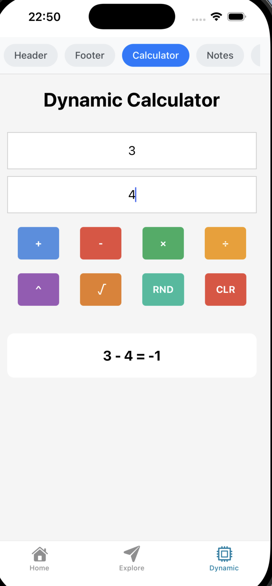

# Dynamic Server-Driven UI App

A mobile application built with React Native and Go backend that demonstrates server-driven UI architecture. The entire user interface is dynamically generated from the backend, allowing for real-time updates without app store deployments.

## Backend Logs

```
❯ ./run.sh
Starting Dynamic Server-Driven UI Backend...
API will be available at http://localhost:8080

Available endpoints:
  GET /api/page/header
  GET /api/page/footer
  GET /api/page/page_calculator
  GET /api/page/page_note_page
  GET /api/page/page_info

[GIN-debug] [WARNING] Creating an Engine instance with the Logger and Recovery middleware already attached.

[GIN-debug] [WARNING] Running in "debug" mode. Switch to "release" mode in production.
 - using env:	export GIN_MODE=release
 - using code:	gin.SetMode(gin.ReleaseMode)

[GIN-debug] GET    /api/page/:name           --> main.getPage (4 handlers)
[GIN-debug] [WARNING] You trusted all proxies, this is NOT safe. We recommend you to set a value.
Please check https://pkg.go.dev/github.com/gin-gonic/gin#readme-don-t-trust-all-proxies for details.
[GIN-debug] Listening and serving HTTP on :8080
[GIN] 2025/09/18 - 22:49:16 | 200 |     712.916µs |             ::1 | GET      "/api/page/page_calculator"
[GIN] 2025/09/18 - 22:49:17 | 200 |      18.042µs |             ::1 | GET      "/api/page/header"
[GIN] 2025/09/18 - 22:49:20 | 200 |          38µs |             ::1 | GET      "/api/page/footer"
[GIN] 2025/09/18 - 22:49:21 | 200 |     226.333µs |             ::1 | GET      "/api/page/page_calculator"
[GIN] 2025/09/18 - 22:49:22 | 200 |     129.208µs |             ::1 | GET      "/api/page/page_note_page"
[GIN] 2025/09/18 - 22:49:24 | 200 |   14.994333ms |             ::1 | GET      "/api/page/page_calculator"
```

## IOS Simnulator Logs

```
iOS Bundled 349ms node_modules/expo-router/entry.js (1373 modules)
 LOG  Fetching page: http://localhost:8080/api/page/page_calculator
 LOG  Fetched page: page_calculator Code length: 6777
 LOG  Fetching page: http://localhost:8080/api/page/header
 LOG  Fetched page: header Code length: 312
 LOG  Fetching page: http://localhost:8080/api/page/footer
 LOG  Fetched page: footer Code length: 305
 LOG  Fetching page: http://localhost:8080/api/page/page_calculator
 LOG  Fetched page: page_calculator Code length: 6777
 LOG  Fetching page: http://localhost:8080/api/page/page_note_page
 LOG  Fetched page: page_note_page Code length: 3773
 LOG  Fetching page: http://localhost:8080/api/page/page_calculator
 LOG  Fetched page: page_calculator Code length: 6777
```

## Backend on Full Server Driven UI

```bash
❯ curl -s http://localhost:8080/api/page/footer | jq .
{
  "name": "footer",
  "code": "\nconst FooterComponent = () => {\n  return React.createElement(View, {\n    style: { backgroundColor: '#333', padding: 15, alignItems: 'center' }\n  },\n    React.createElement(Text, {\n      style: { color: 'white', fontSize: 12 }\n    }, '© 2025 Dynamic App - Diego Pacheco')\n  );\n};\n\nreturn FooterComponent;\n"
}
```


## Dynamic APP Result



## Architecture

- **Frontend**: React Native + Expo
- **Backend**: Go + Gin Gonic
- **Pattern**: Server-Driven UI

## Project Structure

```
.
├── app/                    # React Native mobile app
│   ├── components/         # Reusable components
│   │   └── DynamicRenderer.tsx  # Core dynamic UI renderer
│   ├── services/          # API services
│   │   └── api.ts         # Backend communication
│   └── app/(tabs)/        # Navigation screens
│       └── dynamic.tsx    # Main dynamic page
└── backend/               # Go backend server
    ├── main.go           # Server implementation
    └── go.mod            # Go dependencies
```

## Features

- **Dynamic UI Rendering**: All UI components are fetched from the backend
- **Dynamic Code Execution**: JavaScript code is served from backend and executed in React Native
- **Multiple Page Types**: Header, Footer, Calculator, Notes, Info pages
- **Interactive Components**: Calculator with arithmetic operations including power, square root, random numbers
- **Note Taking**: Save and display notes dynamically
- **Real-time Updates**: UI changes without app redeployment
- **Safe Code Evaluation**: Dynamic code runs in controlled context with fallback implementations

## Available Pages

The backend serves the following dynamic pages via `/api/page/{name}`:

- `header` - App header component
- `footer` - App footer component
- `page_calculator` - Interactive calculator page
- `page_note_page` - Note-taking functionality
- `page_info` - App information and features

## Setup Instructions

### Backend Setup

1. Navigate to the backend directory:
   ```bash
   cd backend
   ```

2. Initialize Go modules and install dependencies:
   ```bash
   go mod tidy
   ```

3. Run the backend server:
   ```bash
   go run main.go
   ```

   The server will start on `http://localhost:8080`

4. Test the API endpoints:
   ```bash
   curl http://localhost:8080/api/page/page_calculator
   ```

### Frontend Setup

1. Navigate to the app directory:
   ```bash
   cd app
   ```

2. Install dependencies:
   ```bash
   npm install
   ```

3. Start the development server:
   ```bash
   npm run start
   ```

4. Run on your preferred platform:
   - iOS: `npm run ios` or scan QR code with Camera app
   - Android: `npm run android` or scan QR code with Expo Go app
   - Web: `npm run web`

## Usage

1. Start the backend server first (it must be running on localhost:8080)
2. Launch the React Native app
3. Navigate to the "Dynamic" tab
4. Select different page types from the horizontal scroll menu
5. Interact with the dynamic components:
   - **Calculator**: Perform arithmetic operations
   - **Notes**: Create and save notes
   - **Info**: View app information

## How It Works

### Backend (Go + Gin)

The backend serves complete JavaScript React component functions:

```go
type Page struct {
    Name string `json:"name"`
    Code string `json:"code"`
}
```

Each page returns executable JavaScript code that creates React components using `React.createElement`. The code includes complete component logic, state management, and event handlers.

### Frontend (React Native)

The `DynamicRenderer` component:

1. Receives executable JavaScript code from the API
2. Safely executes the code using Function constructor
3. Creates stable component references using React.useMemo
4. Renders the dynamically created React components

### Dynamic Code Execution

The backend JavaScript code uses `React.createElement` to programmatically create React Native components:

- `React.createElement(View, props, children)` creates `<View>` components
- `React.createElement(Text, props, text)` creates `<Text>` components
- `React.createElement(TextInput, props)` creates `<TextInput>` components
- `React.createElement(TouchableOpacity, props, children)` creates `<TouchableOpacity>` components
- `React.createElement(ScrollView, props, children)` creates `<ScrollView>` components

All component logic, state management, and event handling is defined in the backend-served JavaScript code.

## API Endpoints

- `GET /api/page/header` - Returns header component JavaScript code
- `GET /api/page/footer` - Returns footer component JavaScript code
- `GET /api/page/page_calculator` - Returns calculator page JavaScript code
- `GET /api/page/page_note_page` - Returns notes page JavaScript code
- `GET /api/page/page_info` - Returns info page JavaScript code

## Customization

### Adding New Pages

1. **Backend**: Add a new case in `getPage()` function in `main.go` with complete JavaScript component code
2. **Frontend**: Add the page option to `pageOptions` array in `dynamic.tsx`

### Adding New Component Types

1. **Backend**: Use `React.createElement` with the new component type in the JavaScript code
2. **Frontend**: Ensure the component is available in the DynamicRenderer's execution context

### Adding New Functionality

1. **Backend**: Write complete JavaScript functions including state management and event handlers
2. **Frontend**: No changes needed - all logic is dynamically executed from backend code

## Development Notes

- The backend must be running before starting the frontend
- Changes to backend JavaScript code are reflected immediately in the app
- The app gracefully handles network errors and displays appropriate messages
- All styling, logic, and state management is defined in the backend JavaScript code
- The mobile app acts as a JavaScript runtime with React Native component rendering

## Troubleshooting

- **"Failed to load page"**: Ensure backend server is running on localhost:8080
- **Network errors**: Check that both frontend and backend are on the same network
- **JavaScript execution errors**: Check the DynamicRenderer error display for code execution issues
- **Component state issues**: Ensure React hooks are used properly in backend JavaScript code

## IF this would be production readfy...

1. It would need to have fallbacks (what if page does not load)
2. It would need cachee on the app.
3. it would need encrypt the payload.
4. require tests with more comkplex scenarios and deps
