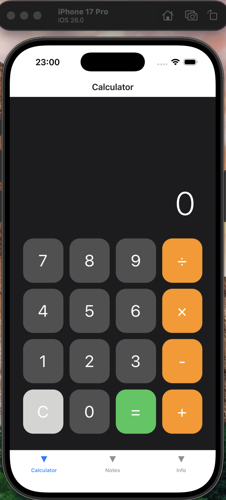
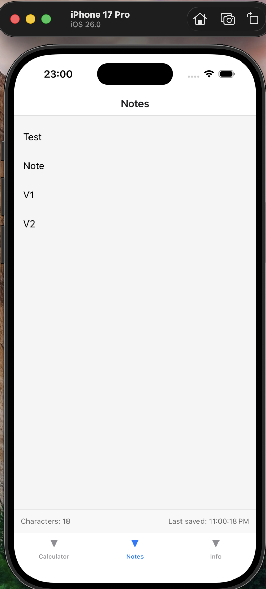
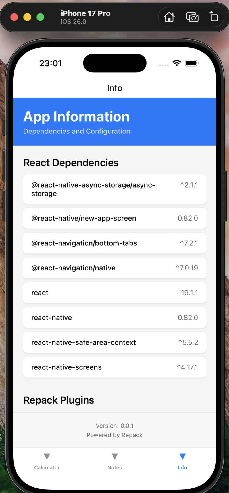

# Repack POC

## Components Flow

1. User navigates to Calculator screen
2. RemoteLoader.createLazyRemoteComponent('Calculator')
3. ScriptManager.loadScript('Calculator')
4. Resolver: 'Calculator' → 'http://localhost:3000/chunks/Calculator.bundle.js'
5. Native module fetches bundle (13.39 KB)
6. Script executed, Calculator component available globally
7. React renders Calculator component
8. Cached in AsyncStorage for next time

## Running 

### Server

run
```
./run-server.sh
```

```
webpack 5.102.1 compiled successfully in 397 ms

Starting remote server...

> remote-server@1.0.0 start
> node server.js

Remote Chunk Server running on http://localhost:3000
Chunks available at http://localhost:3000/chunks/
Health check: http://localhost:3000/health

Available chunks:
  - Calculator.bundle.js (13.48 KB)
  - ContentInfoPage.bundle.js (11.15 KB)
  - FooterContentPage.bundle.js (7.37 KB)
  - HeaderInfoPage.bundle.js (5.71 KB)
  - NoteTaking.bundle.js (14.56 KB)
  - NoteTakingFooter.bundle.js (13.98 KB)
[CHUNK REQUEST] Calculator.bundle.js | Size: 13.48 KB | Duration: 7ms | Status: 304
```

All Chunks
```
http://localhost:3000/chunks/
```

```
{
  "message": "Available chunks",
  "chunks": [
    {
      "name": "Calculator.bundle.js",
      "url": "http://localhost:3000/chunks/Calculator.bundle.js",
      "size": "13.99 KB"
    },
    {
      "name": "ContentInfoPage.bundle.js",
      "url": "http://localhost:3000/chunks/ContentInfoPage.bundle.js",
      "size": "11.47 KB"
    },
    {
      "name": "FooterContentPage.bundle.js",
      "url": "http://localhost:3000/chunks/FooterContentPage.bundle.js",
      "size": "7.69 KB"
    },
    {
      "name": "HeaderInfoPage.bundle.js",
      "url": "http://localhost:3000/chunks/HeaderInfoPage.bundle.js",
      "size": "6.23 KB"
    },
    {
      "name": "NoteTaking.bundle.js",
      "url": "http://localhost:3000/chunks/NoteTaking.bundle.js",
      "size": "15.31 KB"
    },
    {
      "name": "NoteTakingFooter.bundle.js",
      "url": "http://localhost:3000/chunks/NoteTakingFooter.bundle.js",
      "size": "14.73 KB"
    }
  ]
}
```

Get a spesific chunk
```
http://localhost:3000/chunks/Calculator.bundle.js
```

## Run the App

```
./run-ios.sh
```

```
ℹ [05:57:28.008Z][Console] [App] React, ReactNative, and AsyncStorage exposed globally
ℹ [05:57:28.008Z][Console] [ScriptManager] Initialized with resolver and storage
ℹ [05:57:28.009Z][Console] Running "RepackFun" with {"rootTag":11,"initialProps":{},"fabric":true}
ℹ [05:57:28.106Z][Console] [RemoteLoader] Loading Calculator...
ℹ [05:57:28.106Z][Console] [RemoteLoader] Calling ScriptManager.loadScript('Calculator')
ℹ [05:57:28.154Z][Console] [ScriptManager] Resolving script: Calculator
ℹ [05:57:28.154Z][Console] [ScriptManager] DEV mode - URL: http://localhost:3000/chunks/Calculator.bundle.js
ℹ [05:57:28.167Z][Console] [RemoteLoader] Script loaded, checking for component...
ℹ [05:57:28.167Z][Console] [RemoteLoader] Found Calculator on globalThis
ℹ [05:57:28.167Z][Console] [RemoteLoader] SUCCESS: Calculator loaded in 60ms
✔ [05:54:12.985Z][DevServer] Compiled ios in 0.8s
```

### Results

<table>
<tr>
  <td>
    Calc tab on IOS APP <BR/>
    
  </td>
  <td>
    Notes tab on IOS APP <BR/>
    
  </td>
  <td>
    Info tab on IOS APP <BR/>
    
  </td> 
</tr>
</table> 

### Some WHYS

## Why we need 2 servers?

Webpack Dev Server (8081):
* Bundles your HOST app code
* Handles hot reloading during development
* Serves index.bundle to the iOS app
* Without this: Your app won't start at all

Remote Server (3000):
* Serves pre-built REMOTE component chunks
* Components are loaded on-demand via ScriptManager
* Without this: Remote components fail to load (which you saw!)